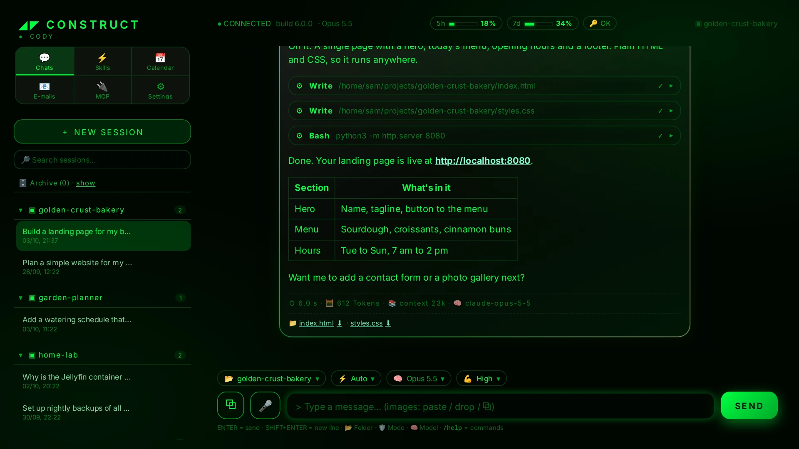
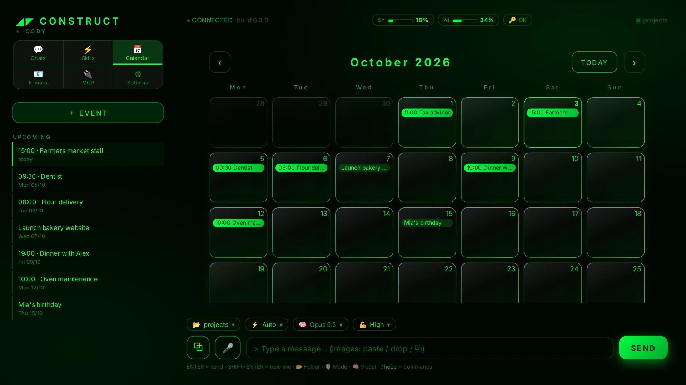
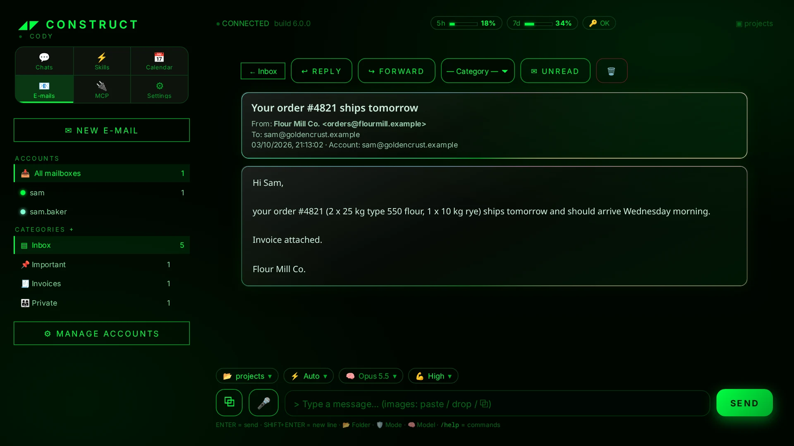
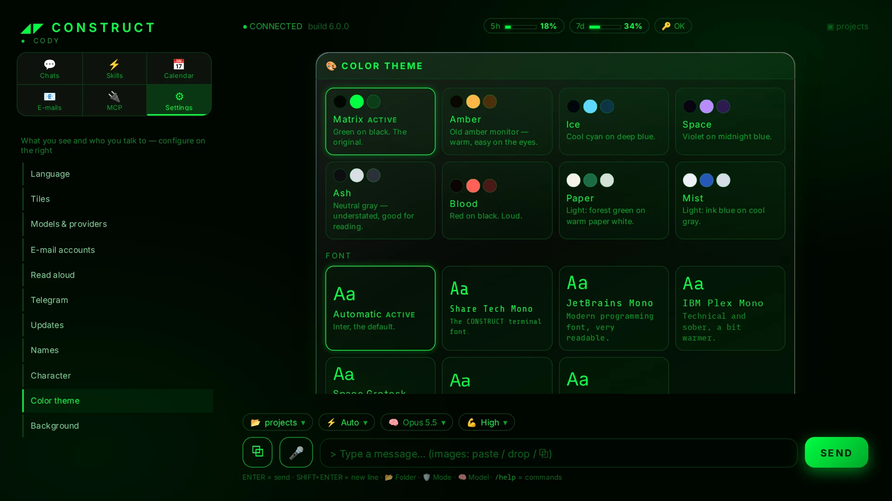

# CONSTRUCT

**A local desktop and web interface for Claude Code, with an AI assistant called Cody.**

https://github.com/user-attachments/assets/63b38b9a-d838-49ab-bc4a-97718ef83d0c

<p align="center">
  
  
</p>
<p align="center">
  
  
</p>

> **Which file do I run?** Only the start script for your system — everything
> else sets itself up.
>
> | System | Start | Double-click |
> |---|---|---|
> | Linux / macOS | `./start.sh` | macOS: `start-mac.command` |
> | Windows | `start.bat` | `start.bat` |
>
> Linux extra (optional): `scripts/linux/install-desktop.sh` adds an application
> menu entry.

## What is CONSTRUCT?

CONSTRUCT is the place; **Cody** is the assistant who lives in it. CONSTRUCT is a
FastAPI backend (`app.py`) and a React frontend (`frontend/`, built into `static/app/`). It
opens in its own window (the app mode of Chrome, Edge, Brave, Chromium, Vivaldi
or Opera) or in any browser tab.

Chats run through the **Claude Code CLI** (`claude -p`), so CONSTRUCT uses your
existing Claude subscription. **You do not need an API key.** You can also use
models from other providers, including local ones, through
[Hermes Agent](https://hermes-agent.nousresearch.com). Hermes gives those models
the same kind of file and terminal tools.

```
Browser / app window ──SSE──► FastAPI (app.py) ──► claude -p     ──► Claude subscription
                                        │          └─► hermes acp  ──► OpenAI / Gemini / DeepSeek / Ollama / Bonsai
                                        └─ reads ~/.claude/projects/*.jsonl (existing sessions)
```

## Features

- **Claude Code chat.** Replies stream token by token. You can browse your
  existing Claude Code sessions and continue any of them (`--resume`), and
  rename, archive or delete sessions. You can queue messages or send them into
  a turn that is still running, and stop a run. Each chat has a working-folder
  picker and a model picker.
- **Edit and resend.** ✎ on one of your messages lets Cody continue from exactly
  that point, as if the old version and everything after it had never
  happened (the session branches with `--resume-session-at`). The original goes
  to the archive, so nothing is lost.
- **Voice input.** 🎤 next to the message field: the text appears in the field
  while you speak (Gemini 3.5 Transcribe Live, streamed over a WebSocket; the
  key stays on the server). Each sentence is cleaned up after the pause —
  filler words disappear. Enter ends dictation, Esc discards it.
- **Read-aloud.** 🔊 above every reply reads it out with Gemini TTS, or every
  new reply automatically. Voice and speaking style per UI language.
- **Image generation.** Ask Cody for an image and it appears right in the
  reply. Runs on [fal.ai](https://fal.ai) with prepaid credit; add the key under
  ⚙ Settings → Image generation. GPT Image 2 is the default (about 5 cents per
  image), Flux 1.1 Ultra and Nano Banana Pro are selectable. Cody calls
  `bild.py`, which saves the image in `uploads/` and can copy it into the
  project.
- **Permission modes.** You choose Claude Code's permission mode per chat
  (`default`, `acceptEdits`, `plan`, `auto`, `dontAsk`, `bypassPermissions`).
  Claude gets real file and terminal access in the selected working folder.
- **Other providers through Hermes.** Supported providers are ChatGPT (OpenAI),
  Gemini, DeepSeek, local **Ollama** models and **Bonsai** (local). Only models
  that can use tools are offered. You manage API keys in the settings panel.
  Cody's persona and calendar reach these models too (via
  `$HERMES_HOME/SOUL.md` — a SOUL.md you wrote for Hermes yourself is left
  alone), and provider failures such as a used-up quota show up as a short
  hint instead of a raw error.
- **Ollama management.** You can list and delete installed models, and pull
  models from a curated catalog or by name with a progress bar. On Linux, if
  Ollama is missing, CONSTRUCT can install it with one click into your user
  account.
- **Bonsai (local).** CONSTRUCT runs PrismML's Bonsai models through the
  `llama-server` from [Bonsai-demo](https://github.com/PrismML-Eng/Bonsai-demo).
  The server starts on the first prompt and stops after a period of inactivity
  or when CONSTRUCT exits, so it only uses VRAM while it's needed.
- **Attachments.** You can paste, drag and drop, or upload images and PDFs.
  Images are normalized: EXIF orientation is applied, metadata is removed,
  images are resized to 2048×2048 or smaller and HEIC is converted. PDFs get a
  text extract.
- **Rendered replies.** Markdown and code are highlighted, and file paths in
  replies are clickable. Clicking one opens a preview or download of that file
  from the workspace.
- **Tickets.** A ticket is a section *inside* a session, not the session: you
  work all day in one session per project and give it many tasks, and a ticket
  collects every message that belongs to one task — even with gaps (task,
  correction, new task, another correction to the first = two tickets). Messages
  go to the current ticket on their own; the chip above the input, `/ticket
  Title` and ✂ on a message cut or reassign them without costing tokens, and the
  assistant can file messages itself with one marker line at the end of its
  answer, only when needed (about 0.5 % extra usage, no MCP server; switch it off
  in ⚙ Settings → Team). A new ticket closes the previous one, a correction
  reopens a closed one. The **Tickets** tile shows, per day and
  project, what is done and what is open; a click jumps to the message in the
  history. In the room a card-index box on a pedestal opens them.
- **Team mode (optional).** A company of AI employees next to the single
  assistant: staff files (character, model, effort, tools, permissions, memory),
  jobs that the staff pass between each other over an internal bus, safety
  brakes against endless loops, a fixed crew of five, shared know-how
  ("instructions") and a fixed test bench. The assistant is the managing
  director. You decide per task: small things the assistant does alone, big ones
  you give to the company (`/firma …`, the 🏢 button on a ticket, or — if you
  allow it — the assistant suggests it). Off by default; switch on under
  ⚙ Settings → Team. In the room the crew sits at two double desks behind the assistant; whoever works gets
  up, walks to the workbench and types there, and the director looks in on
  them. Employees can also be talked to directly (👥 Staff → Talk to
  …). Data lives in `firma/` (not versioned). See
  [`scripts/pruefstand/README.md`](scripts/pruefstand/README.md) for the test bench.
- **Skills browser.** Shows global skills (`~/.claude/skills`) and per-project
  skills from `.claude/skills`, `.agents/skills` and `skills/*.py`.
- **Calendar.** Events are stored in `events.json`, which the UI, Cody (through
  the `cal.py` CLI) and the Telegram bot all share. Upcoming events are added to
  Cody's context.
- **E-mail.** Supports IMAP/SMTP with GMX and Gmail (app password) and
  Outlook/Hotmail (OAuth2 device flow). You can read, send, delete, flag and
  add attachments. Categories are stored locally.
- **MCP connectors.** Shows your configured MCP servers and their status
  (`claude mcp list`).
- **Persona.** You can edit Cody's character (`SOUL.md`) and what Cody knows
  about you (`USER.md`) in the UI. Both are added to the system prompt — for
  Claude and for every Hermes provider. The persona belongs to your
  installation: `SOUL.md` is created from `SOUL.default.md` on first start, is
  not versioned and survives updates, so you can give your assistant a
  different name and character without touching the code.
  Local models (Bonsai, Ollama) can get a persona of their own under
  ⚙ Settings → Character → Local models (`SOUL.lokal.md`), for example to try
  out playful system prompts without touching Cody.
- **Look.** Eight color themes (Matrix, Amber, Ice, Space, Ash, Blood, Paper,
  Mist), all in a rounded glass design written in plain CSS: borderless
  panels over a calm, static gradient. No WebGL, so it also runs smoothly with
  software rendering (e.g. NVIDIA under Wayland). Background: Matrix rain,
  your own image or plain. Six bundled fonts, no internet needed.
- **Settings panel (⚙).** Choose which tiles are visible, the language, theme,
  font, background, display names and avatars, read-aloud voice, the
  Hermes home directory, and update behavior.
- **Usage limits.** Shows your subscription's 5-hour and 7-day usage in the
  header, including the reset time when you hit a limit.
- **Web login.** Signs in to Claude Code from the UI through `claude setup-token`.
  This creates a long-lived token, so you don't need a terminal login
  (Linux/macOS only).
- **Auto-updates.** Keeps Claude Code and Hermes up to date in the background at
  startup. CONSTRUCT also updates itself through `git` (fast-forward only)
  before it starts.
- **Telegram (optional).** Set up entirely in the settings panel: paste a bot
  token from @BotFather, send your bot a message and accept the detected chat
  ID. You can then talk to Cody by text or voice message (voice needs the
  optional `faster-whisper` package), get a morning overview and a ping before
  timed events, and receive a message when a long unattended run finishes.
  Calendar events with a prompt run as scheduled tasks and report back via
  Telegram. Model and permission mode (Auto or read-only Plan) are selectable.
  The bot runs inside CONSTRUCT, so it is only reachable while CONSTRUCT is
  running. If the same token is already polled elsewhere, the settings panel
  shows the conflict.
- **Languages.** The UI is available in English (default) and German.

## Requirements

- **Python 3.10+**
- **git** (for installation and self-update)
- **[Claude Code](https://docs.claude.com/en/docs/claude-code)** (`claude` on your `PATH`), signed in to your Claude account.
  Without it, CONSTRUCT still starts, but only Hermes-backed providers work.
- **Optional:** [Hermes Agent](https://hermes-agent.nousresearch.com) for
  non-Claude models (you can install it from the settings panel), Ollama and
  Bonsai-demo.
- **Optional:** a Gemini API key for read-aloud and voice input — free at
  [aistudio.google.com/apikey](https://aistudio.google.com/apikey). The same key
  also unlocks the Gemini models.
- **Own window (optional):** a Chromium-based browser (Chrome, Edge, Brave,
  Chromium, Vivaldi or Opera). Windows always has Edge. Without one, CONSTRUCT
  opens as a tab in your default browser.

## Installation

```bash
git clone https://github.com/kevherrmann/Construct.git construct
cd construct
./start.sh          # Windows: start.bat
```

The first start creates a virtual environment and installs the dependencies
(a minute or two, needs internet once). After that CONSTRUCT runs offline and
updates itself with `git pull` on every start. Everything stays in your user
account; no root or admin rights needed.

**Linux:** `scripts/linux/install-desktop.sh` adds CONSTRUCT to the application
menu (remove it again with `--remove`).

**macOS:** if Gatekeeper blocks the scripts ("cannot be opened"), clear the
download quarantine once in the folder:

```bash
xattr -dr com.apple.quarantine .
chmod +x start.sh start-mac.command
```

**Windows:** sign in to Claude Code once in a terminal (`claude`). The web login
needs a pseudo-terminal, which Windows doesn't provide.

**Manual (server only):**

```bash
python3 -m pip install -r requirements.txt
python3 -m uvicorn app:app --host 127.0.0.1 --port 8765
```

## Running

| Command | Effect |
|---|---|
| `./start.sh` | Server plus its own window (falls back to a browser tab) |
| `./start.sh --web` | Server only, at http://127.0.0.1:8765 |
| `./start.sh --update` | Reinstall Python dependencies |
| `start.bat [--web\|--update]` | The same on Windows |
| `start-mac.command` | Double-click launcher for macOS Finder |

On the first run, `start.sh` creates a virtual environment named after the
platform and Python version, for example `.venv-Linux-x86_64-py3.12`. This lets
one folder be shared between machines. Dependencies are reinstalled only when
the requirements file changes. If CONSTRUCT is already running on the port, only
the window opens. If that instance is older than the code on disk and was
started from the same folder, it is restarted.

**The window.** CONSTRUCT looks for a Chromium-based browser, your default
browser first, and opens the interface in its app mode: a window without tabs
or address bar, with its own taskbar entry. It uses a separate browser profile
(`.fenster/`), so it never ends up between your other tabs. Links from the chat
open in your default browser. Closing the window does not stop the server, so
the Telegram bot and scheduled tasks keep running; starting CONSTRUCT again just
opens the window. To quit, use ⏻ at the top right (or Settings → System). Without a Chromium-based browser you get a normal tab. You can
also install CONSTRUCT from Chrome or Edge ("Install" in the address bar).

If something is stuck: `./start.sh --web` runs the server without a window
(http://127.0.0.1:8765), and `MATRIX_PORT=8766 ./start.sh` uses another port.

## Configuration

Open the settings with **⚙** in the UI. They are saved to `settings.json`, which
you can also edit by hand. CONSTRUCT validates the file when it reads it and
when it writes it.

| Key | Values / default |
|---|---|
| `lang` | `"en"` (default) or `"de"` |
| `theme` | `matrix`, `bernstein`, `eis`, `space`, `asche`, `blut`, `papier`, `nebel` |
| `font` | `""` (automatic: Inter), `share-tech-mono`, `jetbrains-mono`, `ibm-plex-mono`, `space-grotesk`, `exo-2`, `inter` |
| `names` | `{"user": "", "assistant": "Cody"}` |
| `avatars` | `{"user": "", "assistant": ""}`: uploaded image paths |
| `tiles` | `skills`, `kalender`, `mail`, `mcp` (on/off; the chat tile is always shown) |
| `background` | `{"mode": "matrix" \| "image" \| "plain", "image": "", "dim": 60}` |
| `tts` | `{"auto": false, "model": "gemini-3.8-flash-lite-tts", "voice": {"de": …, "en": …}, "style": {"de": "", "en": ""}}` |
| `hermes` | `{"home": ""}`: empty means `~/.hermes` |
| `updates` | `{"auto": true, "interval_h": 6, "construct": true}` |

### Environment variables

| Variable | Purpose |
|---|---|
| `MATRIX_HOST`, `MATRIX_PORT` | Bind address (default `127.0.0.1:8765`) |
| `MATRIX_USER`, `MATRIX_PASS` | Enable HTTP Basic Auth when `MATRIX_PASS` is set (default user `Cody`) |
| `CONSTRUCT_ORIGINS` | Extra addresses the server answers on, comma-separated (e.g. `https://cody.example.org`). Without `MATRIX_PASS` it only answers on `localhost`/`127.0.0.1`/`[::1]` and `MATRIX_HOST` |
| `CODY_WORKSPACE` | Root folder for the folder picker, skills and file access (default `~/projects` or `~/Projekte`, then `$HOME`) |
| `CLAUDE_CODE_OAUTH_TOKEN` | Claude token (the web-login token takes precedence) |
| `CONSTRUCT_NO_UPDATE` | Skip the CONSTRUCT self-update |
| `CONSTRUCT_USER`, `CONSTRUCT_ASSISTANT` | Override display names |
| `HERMES_HOME`, `HERMES_IDLE_TIMEOUT` | Hermes data directory and idle timeout |
| `BONSAI_DIR` | Bonsai-demo location (default `~/projects/Bonsai-demo`) |
| `BONSAI_PORT`, `BONSAI_CTX`, `BONSAI_KV`, `BONSAI_IDLE_MIN` | llama-server port (8790), context (65536), KV cache type (`q4_0`), idle shutdown in minutes (10) |
| `TELEGRAM_TOKEN`, `CODY_CHAT_ID` | Override the Telegram settings, e.g. on a headless server (`python3 telegram_bot.py` runs the bot on its own) |
| `CODY_NOTIFY_MIN_SECS` | Minimum run length before a Telegram notification is sent (90) |
| `CODY_WHISPER_MODEL` | faster-whisper model for Telegram voice messages (`small`) |
| `CONSTRUCT_BROWSER` | Browser for the window, e.g. `/usr/bin/chromium` (must be Chromium-based) |
| `CONSTRUCT_FENSTER` | `0` = always open a normal browser tab instead of a window |
| `CONSTRUCT_TEAM` | `1` = force team mode on (used by the test bench, which runs its own server) |
| `CONSTRUCT_FIRMA_DIR` | Move the company folder (default `firma/`); a moved company brings its own `USER.md` |
| `CONSTRUCT_TEAM_PARALLEL` | How many employee turns run at once (default 2, at most 4) |

### User data

The following files belong to your installation. They are listed in
`.gitignore`, and updates never touch them:

- **Secrets:** `.llm-config.json` (provider keys), `.mail-accounts.json`,
  `.oauth-token`, `.telegram.json` (bot token), `.env`
- **Personal data:** `settings.json`, `SOUL.md` (created from
  `SOUL.default.md`), `USER.md`, `events.json`, `mail_meta.json`,
  `mail_attach/`, `uploads/`, `llm_sessions/`, `sessions_meta.json`,
  `telegram_state.json`, `tasks_state.json`, `tickets/` (ticket assignment per session)
- **The company (team mode):** `firma/` — `agents/`, `auftraege/`, `anleitungen/`, and optional
  overrides of the rules (`HAUSSTIL.md`, `PROTOCOL.md`, `GESTALTUNG.md`, `MODELS.md`)
- **Caches:** `.models-dev-cache.json`, `.update-stamp`, `.venv-*/`, `.fenster/` (browser profile of the window)

Claude Code sessions stay where Claude Code keeps them (`~/.claude/projects`).

Attachments in `uploads/` are deleted together with the chat they belong to.
Attachments that no chat mentions anymore (Telegram files, uploads that were
never sent) are cleaned up after 7 days. An image used as background in the
settings is kept.

## Updating

CONSTRUCT updates itself automatically. On every start, `selfupdate.py` fetches
from GitHub and fast-forwards. The update is skipped if tracked files have local
changes, if you have local commits, or if there is no network. If an update is
applied, the launcher restarts itself. To turn this off, set
`"updates": {"construct": false}` or `CONSTRUCT_NO_UPDATE=1`.

Claude Code and Hermes are updated in the background at most every
`interval_h` hours. You can also update them manually in the settings panel.

To update by hand, run `git pull --ff-only`, then `./start.sh --update`.

## Security

- CONSTRUCT binds to **127.0.0.1** by default and has **no login** unless you
  set `MATRIX_PASS`. Then every request needs HTTP Basic Auth — WebSockets
  (voice input) included, and those also only accept connections from
  CONSTRUCT's own page.
- The default permission mode is `bypassPermissions`. **In that mode, Claude
  runs tools and shell commands without asking.** Never expose CONSTRUCT to a
  network without authentication. Put it behind a password or a reverse proxy
  with TLS.
- The web-login token is stored in `.oauth-token`. API keys and mail
  credentials are stored in `.llm-config.json` and `.mail-accounts.json` with
  mode 600. All of them are gitignored.
- File serving (`/api/file`) is limited to the workspace and refuses dotfiles.
  Skill viewing is limited to the workspace and `~/.claude/skills`.

## Project layout

| File | Purpose |
|---|---|
| `app.py` | Entry point: assembles the FastAPI app (middleware, static files, routers, start/stop) |
| `server/core.py` | Shared basics: paths, workspace, version, persona, `claude` CLI invocation, SSE helpers |
| `server/routes/` | HTTP API, one module per area: `auth`, `files`, `providers`, `system`, `calendar`, `mail`, `sessions`, `chat`, `ui` |
| `server/runs.py`, `server/hermes_runs.py` | Detached chat runs (claude CLI / Hermes): start, stream, inject, background tasks |
| `server/sessions.py` | Claude Code sessions on disk: metadata, transcripts, filters |
| `server/tickets.py` | Tickets inside a session: storage, assignment, the assistant's marker lines |
| `server/team/`, `team_mcp.py` | Team mode: staff files, jobs, brakes, dispatcher, the company bus (MCP server) |
| `scripts/pruefstand.py` | Test bench for the company: fixed jobs, measured results, comparison with the last run |
| `server/scheduler.py` | Scheduled tasks from calendar events |
| `tests/` | Backend tests (`pip install -r requirements-dev.txt && pytest`) |
| `frontend/` | Web interface: React 19 + TypeScript + Vite — see [`frontend/README.md`](frontend/README.md) |
| `static/app/` | Built interface, committed so installs and updates need no Node.js |
| `server/config.py` | `settings.json` and persona files |
| `server/llm.py`, `server/hermes.py`, `server/bonsai.py` | Providers and models: API keys, model lists, Ollama; Hermes Agent (ACP) for non-Claude models; on-demand `llama-server` for Bonsai |
| `server/mail.py` | IMAP/SMTP mail, Outlook OAuth2 |
| `server/telegram_bot.py` | Telegram bot, reminders and notifications (configured in ⚙ Settings) |
| `server/gemini.py` | Shared Gemini API client (key, errors) |
| `server/tts.py` | Read-aloud via Gemini TTS, voice catalog |
| `server/images.py`, `bild.py` | Image generation via fal.ai; `bild.py` is the CLI Cody uses |
| `server/auto_modell.py` | Experimental automatic model choice, shadow mode only (off by default, see `scripts/auto_auswertung.py`) |
| `server/stt.py` | Voice input: relays the microphone stream to Gemini 3.5 Transcribe Live |
| `server/updates.py` | Background updates for Claude Code and Hermes |
| `server/attach.py` | Image normalization and PDF text extraction |
| `desktop.py` | Starts the server and opens the window (browser app mode, falls back to a tab) |
| `cal.py` | Calendar store — also a command-line tool Cody calls (`python3 cal.py`) |
| `selfupdate.py` | Git fast-forward self-update at startup (runs before the virtual environment, standard library only) |
| `start.sh`, `start.bat`, `start-mac.command` | Launchers |
| `scripts/linux/` | Optional Linux helper: application menu entry |
| `SOUL.default.md`, `SOUL.default.en.md` | Default persona templates |

## Frontend development

The interface lives in `frontend/` (React 19, TypeScript, Vite). The built
files in `static/app/` are committed on purpose: installing and updating
CONSTRUCT (`git pull`) must not require Node.js. Only if you work on the
frontend do you need **Node.js 20+**:

```bash
cd frontend
npm install
npm run dev      # http://localhost:5173 — talks to CONSTRUCT on :8765
npm run check    # types, lint, format, tests, build
```

Commit the rebuilt `static/app/` together with your source changes — CI
fails if it is out of date. Conventions: [`frontend/README.md`](frontend/README.md).

## Backend development

`app.py` only assembles the FastAPI app; the logic lives in `server/` (routes in
`server/routes/`, one module per area). Run the checks CI runs:

```bash
pip install -r requirements-dev.txt
python -m pyflakes app.py desktop.py cal.py selfupdate.py server tests
python -m pytest -q
```

## Contributing

See [CONTRIBUTING.md](CONTRIBUTING.md) for the project layout, the checks CI
runs and what a change needs. Changes per version: [CHANGELOG.md](CHANGELOG.md).

## License

MIT — see [LICENSE](LICENSE). Bundled third-party packages and fonts:
[THIRD_PARTY_NOTICES.md](THIRD_PARTY_NOTICES.md).

